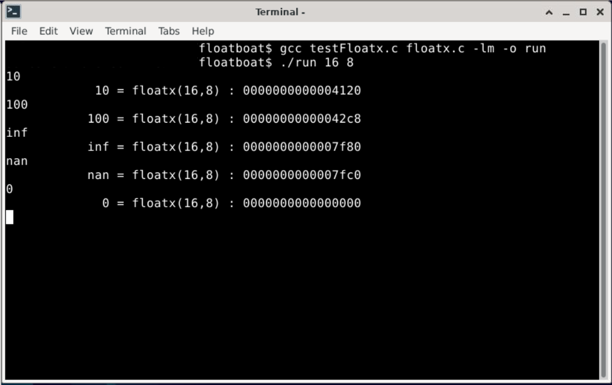

## Floating Point Numbers

This project manipulates the formation of the IEEE floating point standard to form our own "floatx".
A double is taken into the doubleToFloatx function to convert the representation with a certain number of total bits and exponential bits.

Many steps are taken into account. This code dismantles sign bits, exponential bits, and mantissa bits to reform them into our new special order. Caution is recognized with regards to the special cases of float (0.0, infinity, or not-a-number), rebiasing of the exponential bits, and illegal parameters for a floatx. 

TO COMPILE: 
"gcc testFloatx.c floatx.c -lm -o run"

TO RUN:
"./run (total bits) (exponential bits)" 
      (input numbers here)
      
* 

Notes: Subnormal cases may fail to result in an accurate conversion.
       Intended for use on UNIX machines.
       Visual Website for floats: https://evanw.github.io/float-toy/

